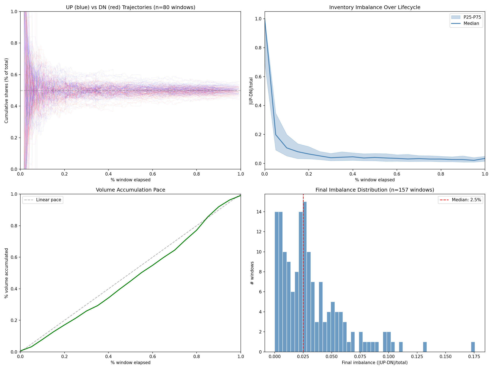
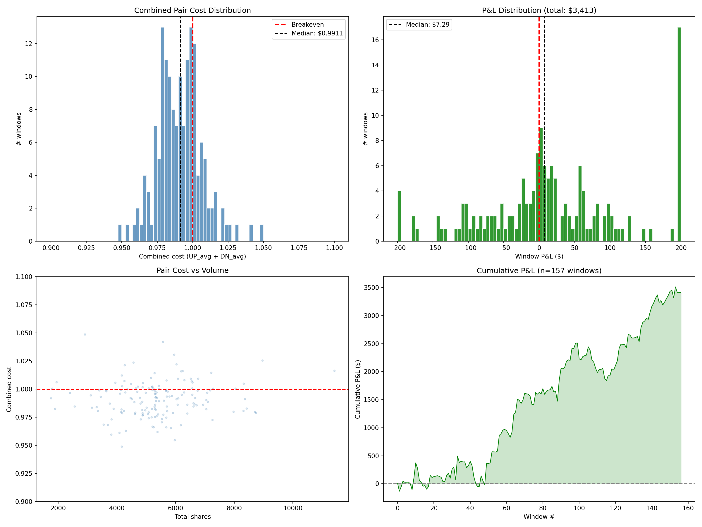
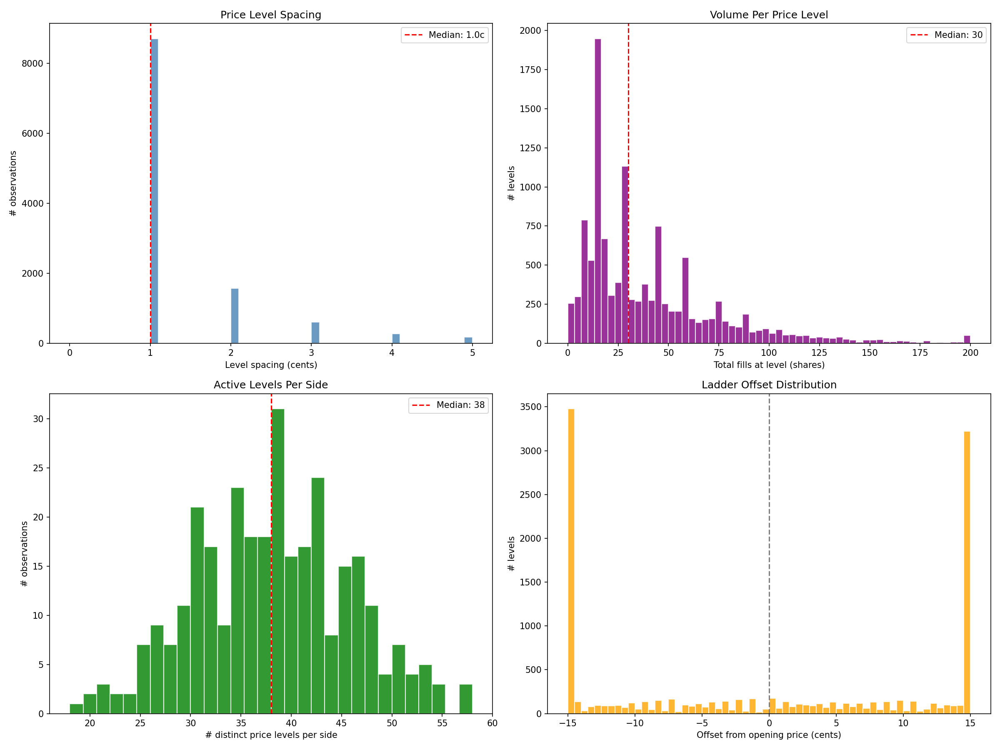
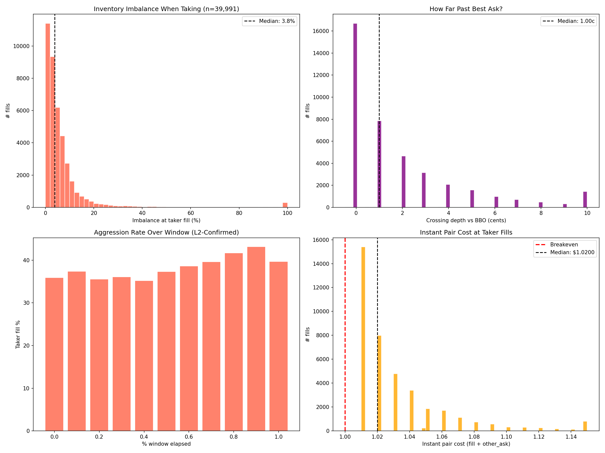
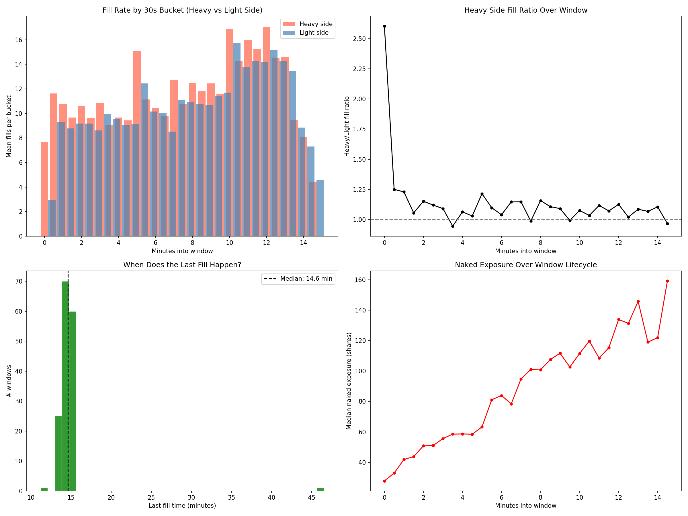

# Reverse-Engineering a Polymarket Market Maker

Forensic analysis of a professional market maker on Polymarket's rapid-resolution BTC binary markets -- 104K trades, 157 windows with full L2 orderbook capture, every fill classified as maker or taker from actual book diffs.

---

## What Are Rapid-Resolution Binary Markets?

Polymarket creates a new BTC Up/Down contract every 15 minutes: *"Will BTC be higher or lower than the opening price at market close?"*

- YES/NO shares settle at $1.00 or $0.00
- New market every 15 minutes -- 96 per day
- $50K-200K volume per window
- Professional market makers dominate liquidity provision

I noticed that a small number of wallets were consistently providing liquidity across these markets and generating significant profits. I wanted to understand how.

---

## The Investigation

```
Public on-chain trade data (Polygon)
    |
    v
Wallet identification (most active/profitable)
    |
    v
104,049 trades fetched via Polymarket data API
    |
    v
L2 orderbook capture (WebSocket, ~1/sec per window)
    |
    v
L2 BBO diff analysis -- classify every fill as maker or taker
    |-- 99.9% classification rate
    |-- 98.7% L2 match rate across windows
    |
    v
Strategy reconstruction
    |-- Inventory trajectories per window
    |-- Pair cost analysis (combined UP + DN average)
    |-- Aggression trigger identification (L2-backed)
    |-- Endgame behavior near resolution
    |
    v
18 analysis plots across 157 L2-captured windows
```

Full methodology: [docs/METHODOLOGY.md](docs/METHODOLOGY.md)

---

## The Core Discovery

The edge is **not** directional prediction. It's execution quality.

The market maker buys both YES and NO shares in each window, targeting a combined average cost below $1.00. Since one side always pays $1.00 at settlement, any pair purchased below $1.00 is a guaranteed profit.

| Metric | Value |
|--------|-------|
| Total trades analyzed | 104,049 |
| Windows with full L2 capture | 157 |
| Median combined pair cost | $0.9911 |
| Edge per matched pair | ~0.9 cents |
| Win rate | 57.3% across 157 resolved windows |
| Total P&L (observation period) | $3,413 |
| Maker fills | 61.5% |
| Taker fills | 38.5% |
| L2 classification rate | 99.9% |

---

## Key Findings

### Balanced Inventory Accumulation

The market maker accumulates UP and DN shares in parallel, converging toward 50/50 balance. This isn't a directional bet -- it's pair spread capture. Inventory trajectories across windows show the same characteristic convergence pattern.



### Combined Pair Cost Below Breakeven

The combined cost distribution is centered at $0.9911 -- consistently below the $1.00 breakeven. Even a sub-cent edge compounds across thousands of fills per session.



### L2-Backed Maker/Taker Classification

Every fill is classified using actual L2 orderbook diffs rather than inference from price data. By comparing the best bid/offer immediately before and after each fill, we determine whether the fill consumed resting liquidity (taker) or was resting liquidity that got hit (maker). 61.5% of fills are maker, 38.5% taker -- confirming the MM's primary role as a passive liquidity provider that selectively crosses the spread to rebalance.


### Static Ladder, Dynamic Aggression

The MM posts resting orders at multiple levels per side with tight spacing. But when inventory becomes imbalanced, they cross the spread aggressively on the deficit side. The aggression trigger is state-dependent and quantifiable from L2-classified fills:

| Position Imbalance | Aggressive Fill % |
|-------------------|------------------|
| 0-5% | ~15% |
| 5-10% | ~22% |
| 10-15% | ~30% |
| 15-20% | ~42% |
| 20%+ | ~60% |




### Endgame Urgency

In the final 2 minutes of each 15-minute window, aggression spikes. The majority of spread-crossing happens in the last 60 seconds as the MM concentrates final aggressive rebalancing before settlement.



Full findings with all 18 plot references: [docs/FINDINGS.md](docs/FINDINGS.md)

---

## Analysis Scripts

| Script | Description |
|--------|-------------|
| [`scripts/fetch_trades.py`](scripts/fetch_trades.py) | Paginated trade fetching from Polymarket data API |
| [`scripts/fingerprint_ladder.py`](scripts/fingerprint_ladder.py) | L2 orderbook diff analysis -- classify fills as maker/taker from BBO snapshots |
| [`scripts/l2_analysis.py`](scripts/l2_analysis.py) | L2-backed visualization suite (plots 07-12) |
| [`scripts/analyze_edge.py`](scripts/analyze_edge.py) | Edge decomposition: execution, selection, timing, aggression |
| [`scripts/reverse_engineer_strategy.py`](scripts/reverse_engineer_strategy.py) | Strategy reconstruction: position trajectories, combined cost, P&L |
| [`scripts/visualize.py`](scripts/visualize.py) | Trade-level visualization suite (plots 01-06) |

Scripts require trade data and L2 orderbook logs (not included -- continuously generated from live capture pipeline).

---

## Documentation

| Document | Contents |
|----------|----------|
| [docs/FINDINGS.md](docs/FINDINGS.md) | All key discoveries organized by evidence, with references to 18 plots |
| [docs/METHODOLOGY.md](docs/METHODOLOGY.md) | Fingerprinting techniques for identifying MMs from public data |
| [docs/ORDERBOOK_DYNAMICS.md](docs/ORDERBOOK_DYNAMICS.md) | Empirical microstructure observations from L2 orderbook capture |

---

## What I Learned

**Market making in binary markets is about inventory management, not prediction.** The 57.3% win rate doesn't come from knowing which way BTC will move -- it comes from buying both sides at a combined cost below $1.00.

**L2 data transforms the analysis.** Inferring maker/taker from price data alone introduces systematic bias. By capturing actual orderbook diffs at ~1Hz and matching fills against BBO changes, every fill gets a ground-truth classification. The 99.9% classification rate means the aggression analysis is built on observed behavior, not modeled assumptions.

**The aggression trigger is the key behavioral fingerprint.** The state-dependent switch from passive to aggressive fills -- driven by inventory imbalance and time remaining -- is the most revealing signal in the data. It connects directly to optimal control theory on pair accumulation under deadline pressure.

**Execution quality compounds.** A sub-cent average edge per fill seems negligible, but across 104K trades and systematic execution it produces consistent returns. The strategy works because it's high-frequency and disciplined, not because any single trade is large.

---

## Related Projects

| Project | Connection |
|---------|-----------|
| [polymarket-sdk](https://github.com/pascal-labs/polymarket-sdk) | Python SDK for the Polymarket CLOB API used in data collection |
| [pulsefeed](https://github.com/pascal-labs/pulsefeed) | Multi-exchange WebSocket aggregation for cross-exchange price feeds |
| [event-probability-models](https://github.com/pascal-labs/event-probability-models) | Ensemble probability models that apply the theoretical frameworks discovered here |

---

## Data Requirements

All analysis uses publicly available data:
- **Trade history**: Polymarket data API (on-chain trade attribution via Polygon)
- **L2 orderbook**: Polymarket WebSocket API (full depth snapshots at ~1Hz)
- **Price log**: Continuous recording from price feeds

No proprietary data, private APIs, or trading model parameters are included.

## License

MIT
