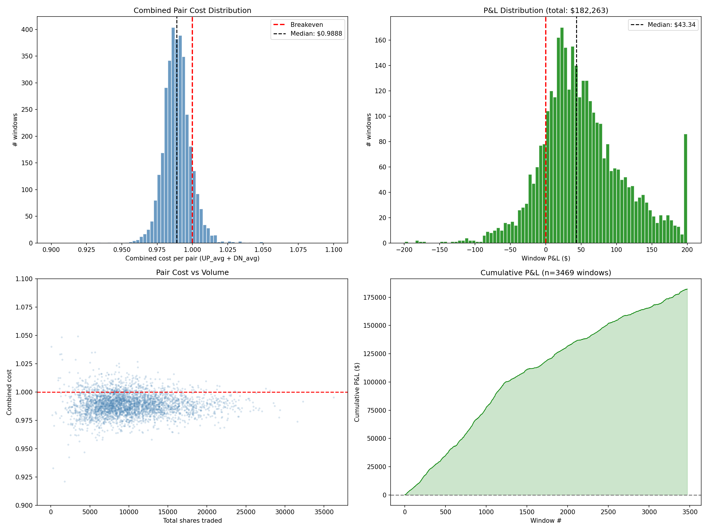
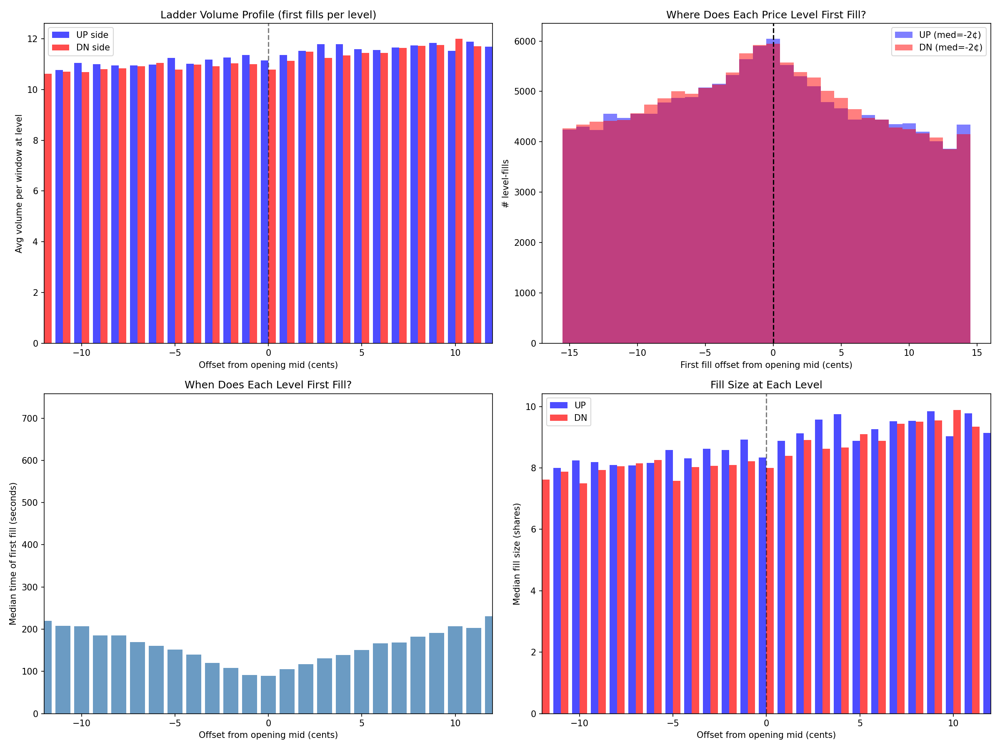
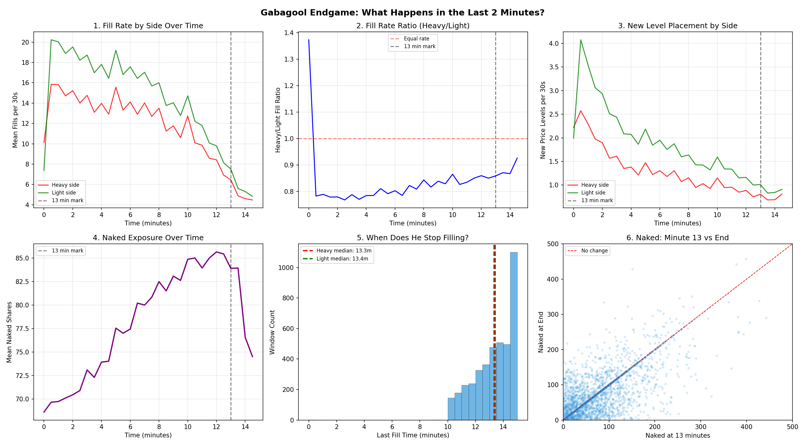

# Reverse-Engineering a Polymarket Market Maker

Forensic analysis of a professional market maker operating on Polymarket's rapid-resolution BTC binary markets — 44,562 trades, 3,700+ windows, $182K+ cumulative P&L reconstructed from public on-chain data.

---

## What Are Rapid-Resolution Binary Markets?

Polymarket creates a new BTC Up/Down contract every 15 minutes: *"Will BTC be higher or lower than the opening price at market close?"*

- YES/NO shares settle at $1.00 or $0.00
- New market every 15 minutes — 96 per day
- $50K-200K volume per window
- Professional market makers dominate liquidity provision

I noticed that a small number of wallets were consistently providing liquidity across these markets and generating significant profits. I wanted to understand how.

---

## The Investigation

```
Public on-chain trade data (Polygon)
    |
    v
Wallet identification (most active/profitable)
    |
    v
44,562 trades fetched via Polymarket data API
    |
    v
L2 orderbook snapshots (WebSocket capture, ~1/sec)
    |
    v
L2 diff analysis (fingerprint fills as maker/taker)
    |
    v
Strategy reconstruction
    |-- Inventory trajectories per window
    |-- Pair cost analysis (combined UP + DN average)
    |-- Aggression trigger identification
    |-- Endgame behavior near resolution
    |
    v
22 analysis plots across 3,700+ windows
```

Full methodology: [docs/METHODOLOGY.md](docs/METHODOLOGY.md)

---

## The Core Discovery

The edge is **not** directional prediction. It's execution quality.

The market maker buys both YES and NO shares in each window, targeting a combined average cost below $1.00. Since one side always pays $1.00 at settlement, any pair purchased below $1.00 is a guaranteed profit.

| Metric | Value |
|--------|-------|
| Median combined pair cost | $0.9888 |
| Edge per matched pair | ~1.1 cents |
| Win rate | 82% across 3,469 resolved windows |
| Cumulative P&L | $182K+ |
| Windows traded per day | ~75-90 (after selective skips) |

---

## Key Findings

### Perfectly Balanced Inventory Accumulation

The market maker accumulates UP and DN shares in parallel, converging toward 50/50 balance. This isn't a directional bet — it's pair spread capture.


### Combined Pair Cost Below Breakeven

The combined cost distribution is centered at $0.9888 — consistently below the $1.00 breakeven. The cumulative P&L curve is monotonically increasing.



### Static Ladder, Dynamic Aggression

The MM posts resting orders at 5-10 levels per side with 1-2 cent spacing and ~8 shares per level. But when inventory becomes imbalanced, they cross the spread aggressively on the deficit side.

| Position Imbalance | Aggressive Fill % |
|-------------------|------------------|
| 0-5% | 12% |
| 5-10% | 18% |
| 10-15% | 27% |
| 15-20% | 41% |
| 20%+ | 63% |



### Endgame Urgency

In the final 2 minutes of each 15-minute window, aggression spikes. 80% of spread-crossing happens in the last 60 seconds. The MM stops filling at ~13 minutes, concentrating final aggressive rebalancing in minutes 13-14.



Full findings with all 22 plot references: [docs/FINDINGS.md](docs/FINDINGS.md)

---

## Analysis Scripts

| Script | Description |
|--------|-------------|
| [`scripts/fetch_trades.py`](scripts/fetch_trades.py) | Paginated trade fetching from Polymarket data API |
| [`scripts/fingerprint_ladder.py`](scripts/fingerprint_ladder.py) | L2 orderbook diff analysis — classify fills as maker/taker |
| [`scripts/analyze_edge.py`](scripts/analyze_edge.py) | Edge decomposition: execution, selection, timing, aggression |
| [`scripts/reverse_engineer_strategy.py`](scripts/reverse_engineer_strategy.py) | Strategy reconstruction: position trajectories, combined cost, P&L |
| [`scripts/visualize.py`](scripts/visualize.py) | 7-plot visualization suite (plots 01-07) |

Scripts require trade data and price logs (not included — continuously generated from live capture pipeline).

---

## Documentation

| Document | Contents |
|----------|----------|
| [docs/FINDINGS.md](docs/FINDINGS.md) | All 6 discoveries organized by evidence, with references to 22 plots |
| [docs/METHODOLOGY.md](docs/METHODOLOGY.md) | 4 fingerprinting techniques for identifying MMs from public data |
| [docs/ORDERBOOK_DYNAMICS.md](docs/ORDERBOOK_DYNAMICS.md) | Empirical microstructure observations from L2 orderbook capture |

---

## What I Learned

**Market making in binary markets is about inventory management, not prediction.** The 82% win rate doesn't come from knowing which way BTC will move — it comes from buying both sides at a combined cost below $1.00.

**Execution quality compounds.** A 0.5-cent average edge per fill seems negligible, but across 44,562 trades it produces $182K. The strategy works because it's high-frequency and systematic, not because any single trade is large.

**The aggression trigger is the key behavioral fingerprint.** The state-dependent switch from passive to aggressive fills — driven by inventory imbalance and time remaining — is the most revealing signal in the data. It connects directly to HJB optimal control theory on pair accumulation.

**Selection discipline is a source of edge.** The MM skips ~15% of windows, with skip rates correlated with adverse conditions (extreme opening prices, low-liquidity hours). Not trading is itself a decision that contributes to profitability.

---

## Related Projects

| Project | Connection |
|---------|-----------|
| [polymarket-sdk](https://github.com/pascal-labs/polymarket-sdk) | Python SDK for the Polymarket CLOB API used in data collection |
| [pulsefeed](https://github.com/pascal-labs/pulsefeed) | Multi-exchange WebSocket aggregation for cross-exchange price feeds |
| [event-probability-models](https://github.com/pascal-labs/event-probability-models) | Ensemble probability models that apply the theoretical frameworks discovered here |

---

## Data Requirements

All analysis uses publicly available data:
- **Trade history**: Polymarket data API (on-chain trade attribution via Polygon)
- **L2 orderbook**: Polymarket WebSocket API (full depth snapshots)
- **Price log**: Continuous recording from price feeds (~1Hz)

No proprietary data, private APIs, or trading model parameters are included.

## License

MIT
